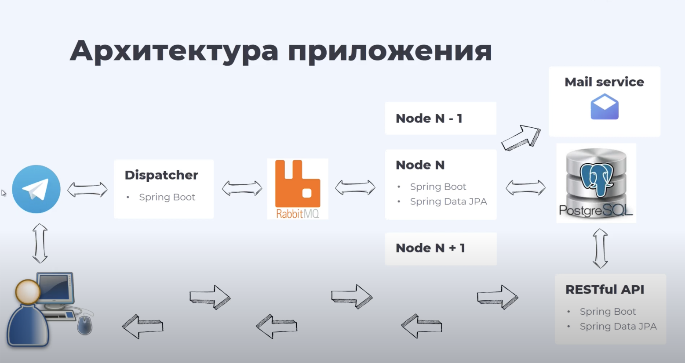

# File Exchange System

This file exchange system with asynchronous message processing is developed as a part of the "Telegram Bot in Java" course by Russian IT company [Relex](https://relex.ru).

## Application Workflow:

*   **Bot Launch:** Enter the command /help to get a list of available commands.
*   **Registration in the Application:** Enter your email.
*   **Registration Completion:** Follow the link from the incoming email sent to the specified email during registration.
*   **Content Upload:** Send files or photos to the Telegram bot chat.
*   **Content Download:** Receive a link to an external resource for downloading the file and upload the file.

## Application Operation:

The user launches the bot and sends a message. The Telegram server then receives the message, and the dispatcher contacts Telegram for new messages. The dispatcher receives a new message, performs minimal validation, converts it into JSON format, and sends it to RabbitMQ. The dispatcher also retrieves responses from the broker and returns them to Telegram. Thus, the entire message exchange occurs through the dispatcher.

The message broker ensures asynchronous processing and distribution of messages among bot subscribers using the node microservice. Nodes are necessary for the parallel processing of bot subscriber requests.

