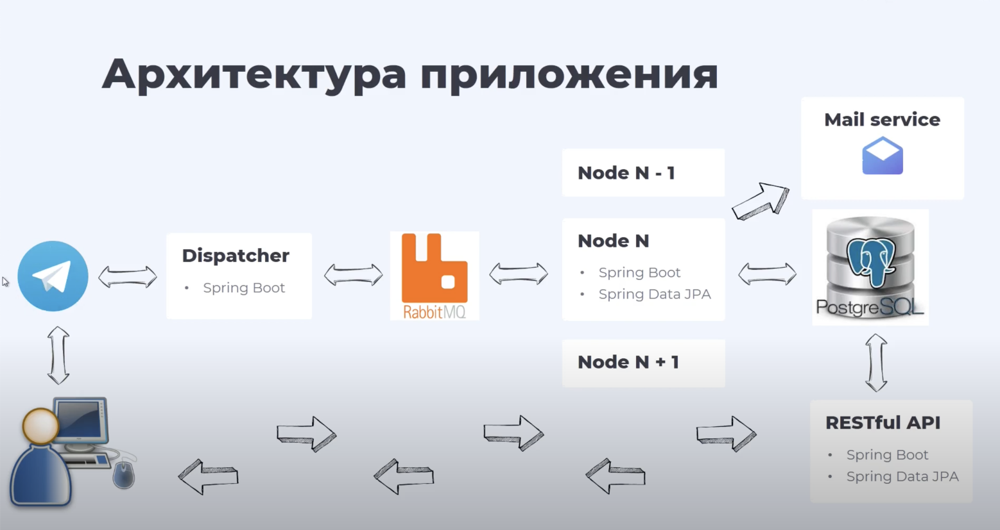

# Система Обмена Файлами

Данная система обмена файлами с асинхронной обработкой сообщений разработана в рамках курса "Telegram Bot на Java" от российской IT-компании [Relex](https://relex.ru).

## Ход Работы Приложения:

*   **Запуск Бота:** Введите команду /help, чтобы получить список доступных команд.
*   **Регистрация в Приложении:** Введите свой адрес электронной почты.
*   **Завершение Регистрации:** Перейдите по ссылке из входящего письма, отправленного на указанный при регистрации почтовый ящик.
*   **Загрузка Контента:** Отправьте файлы или фотографии в чат Telegram бота.
*   **Скачивание Контента:** Получите ссылку на внешний ресурс для скачивания файла и загрузите файл.

## Работа Приложения:

Пользователь запускает бота и отправляет сообщение. Сервер Telegram затем получает сообщение, и диспетчер обращается к Telegram за новыми сообщениями. Диспетчер получает новое сообщение, проводит минимальную валидацию, преобразует его в формат JSON и отправляет в RabbitMQ. Диспетчер также извлекает ответы от брокера и возвращает их в Telegram. Таким образом, весь обмен сообщениями происходит через диспетчер.

Брокер сообщений обеспечивает асинхронную обработку и распределение сообщений между подписчиками бота с использованием микросервиса node. Ноды необходимы для параллельной обработки запросов подписчиков бота.

